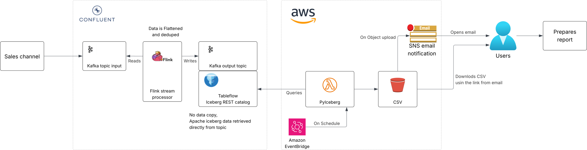

# Table of Contents
- [What is data streaming](#what-is-data-streaming)
- [Why data streaming is needed](#why-data-streaming-is-needed)
- [What is Confluent Flink](#what-is-confluent-flink)
- [What is Confluent Tableflow](#what-is-confluent-tableflow)
- [Business use case](#business-use-case)
- [Solution overview](#solution-overview)
  - [Purpose](#purpose)
  - [Benefits](#benefits)
  - [Challenges](#challenges)
- [Conclusion](#conclusion)
- [Deployment and implementation details](#deployment-and-implementation-details)
  - [Prerequisites](#prerequisites)
  - [Deployments steps](#deployments-steps)
- [References](#references)

# What is data streaming

Data streaming is the continuous transfer of data from one or more sources at a steady, high speed for processing into specific outputs. Data streaming is not new, but its practical applications are a relatively recent development [4]. 

Data streams are generated by all types of sources, in various formats and volumes. From applications, networking devices, and server log files, to website activity, banking transactions, and location data, they can all be aggregated to seamlessly gather real-time information and analytics from a single source of truth [2].

# Why data streaming is needed

Real worlds data is arriving gradually overtime, as your users are producing it now, produced it yesterday and will produce it in future. Unless you go out of business, this process never ends, and so the dataset is never complete in meaningful way [1, 439 p.]. 

Todays users expect instant results, whether it would come in form of a analytical dashboard providing insights into business, showing system metrics or even military and intelligence systems to raise alerts on signs of attack [1, 465 p.].

Streaming data allows to process data in small time windows or even continuously, using single event as it arrives.     

# What is Confluent Flink

Apache Flink® is a powerful, scalable stream processing framework for running complex, stateful, low-latency streaming applications on large volumes of data. Flink excels at complex, high-performance, mission-critical streaming workloads and is used by many companies for production stream processing applications. Flink is the de facto industry standard for stream processing [3].

Confluent’s fully managed Flink service enables you to:
* Easily filter, join, and enrich your data streams with Flink
* Enable high-performance and efficient stream processing at any scale, without the complexities of managing infrastructure
* Experience Kafka and Flink as a unified platform, with fully integrated monitoring, security, and governance

For additional details: [Confluent Flink overview](https://docs.confluent.io/cloud/current/flink/overview.html#what-is-af-long)

# What is Confluent Tableflow

Tableflow enables you to represent Apache Kafka® topics and associated schemas as open table formats such as Apache Iceberg™ or Delta Lake in a few clicks to feed any data warehouse, data lake, or analytics engine, eliminating the complexities of data pre-processing, preparation, and transfer [5]. 

Tableflow automates key tasks, such as schematization, type conversions, schema evolution, Change Data Capture (CDC) stream materialization, table metadata publishing to catalogs, and table maintenance.

Tableflow introduces support for:
* Iceberg: Now Generally Available, exposing streaming data in Confluent Cloud-hosted Kafka topics as Iceberg tables.
* Delta Lake: Now in Open Preview, enabling you to explore materializing Kafka topics as Delta Lake tables in your own storage. These tables can be consumed as storage-backed external tables from Databricks.

For additional details: [Tableflow in Confluent Cloud overview](https://docs.confluent.io/cloud/current/topics/tableflow/overview.html#tableflow-in-ccloud)

# Business use case

Let's put theory into practice, global e-commerce organization with multiple sales channels would like their analysts to:
* Analyze sales channel data on weekly bases for past week in order to understand product demand and customer behavior based on current offering.

Additionally following requirements must be met: 
* Aggregated weeks data is required to be a flat file (CSV) export.
* Sales channel data contains product, order and customer information, thus PII data has to be obfuscated.
* Data is streamed into existing managed Confluent Kafka as a separate events.
* Deduplicated data is required for accurate analysis. 
* Events uses AVRO encoding with Schema registry.

# Solution overview

There are multiple ways to solve this problem, for instance using AWS Lambda native support for AVRO [8] for consuming channel events, performing obfuscation and deduplication of data before storing them in DynamoDB, while preparing export. 

Alternatively Confluent Flink snapshot queries maybe used, however at the time of writing (2025-07-11) feature is in early access.

## Purpose

However goal for today will be test feasibility of solution based on Confluent Cloud managed Flink and Tableflow. The following high level architecture is displayed in figure.



The solution consists of the following steps:
* Sales channel data is received as it is and is stored in Kafka input topic.
* Managed Flink processes channel event:
  * Performs deduplication on events.
  * Obfuscates PII data (out of scope in PoC code).
  * Stores processed data in Kafka output topic for consumption.
* AWS Lambda on schedule queries Tableflow enabled output topic and stores query result as flat file on object store.
* On file creation email notification with a link to export is sent to business analyst (out of scope in PoC code)
* Business analyst downloads the file and prepares report.

## Benefits

* Shift-left stream processing. Confluent Cloud for Apache Flink powers real-time stream processing on Kafka topics, which are subsequently materialized into tables using Tableflow. With Flink, you can implement business-specific logic such as filtering, deduplication, personally identifiable information (PII) removal, and data stream-level joining. This approach significantly minimizes the need for expensive post-processing in data lakes or data warehouses [12].
* Tableflow removes need of copying data to temporary storage.
* It is fully managed solution, thus you can focus on core business, as proactive maintenance and security, scalability etc. are handled by Confluent.
* Predictable monthly cost.
* Looks good on CV :).

## Challenges

* Flink queries are running continuously, for thus running costs has to be measured, multiple use cases might be needed to justify cost [10].
* Tableflow adds additional cost [11], as you will be charged by amount you are running the service on a topic.
* Events in output topics are earliest after deduplication as Tableflow only supports append only Flink tables (Kafka topics) [9].
* Although completely managed, relatively complex solution.
* There's a learning curve to it, as multiple different technologies and tools involved, PyIceberg, Flink, AWS.

# Conclusion

After performing this experiment we have arrived at the following conclusions:
* The Solution is relatively high cost, thus requires careful consideration if to be used for this use case, may require accompanying use cases to proceed.
* The solution is fully managed and can cope with large amounts of data.
* For particular use case Flink Snaphot query may be more suitable, however it is early access [13] or AWS only based solution.

# Deployment and implementation details

Section outlines deployment of such solution.
The accompanying code is in no way shape or form production ready.

## Prerequisites

* Basic knowledge of Terraform, Python, SQL. 
* AWS Account.
* Confluent Cloud account, free trial will work.
* Confluent Cloud, Kafka, Flink, Tableflow API keys and secrets.
* Existing Kafka input topic.
* Datagen connector with AVRO enabled schema, which will simulate channel data.

## Deployments steps

* Rename `iac/terraform.tfvars.example` file to `iac/terraform.tfvars` and put Confluent Cloud, Kafka, Flink, Tableflow API keys and secrets in it.
* Create a Kafka output topic (Topic) within Confluent cloud using terraform
* Enable Tableflow for the topic, Confluent managed metadata storage using terraform, it is secure and needs no setup. Confluent provides terraform resources [here](https://registry.terraform.io/providers/confluentinc/confluent/latest/docs/resources/confluent_tableflow_topic)
* Create Flink job using terraform, which inserts flattened deduplicated events from source topic to target topic created. Terraform resource docs [here](https://docs.confluent.io/cloud/current/flink/operate-and-deploy/deploy-flink-sql-statement.html#flink-deploy-sql-statement-sql-statement)
* Create S3 bucket using terraform.
* Create Lambda with EventBridge source on schedule (Not implemented). 
* Create SNS with email notification (Not implemented).
* Use EventBridge scheduled Lambda with PyIceberg to fetch the data from target topic.
  * Lambda has to be in docker container as `PyIceberg` dependencies extracted over 450MB.
  * Same lambda Uses PyIceberg to export filtered data as CSV on S3.
* S3 sends email notification through SNS to a customer (Not implemented).

Commands to remember 
```
# change dir
cd confluent-topic-to-csv-with-flink-tableflow/iac

# ensure correct AWS profile set
export AWS_PROFILE=your-aws-profile

# deploy the PoC
terraform init
terraform apply
```

# References

* [1] Designing Data-Intensive Applications, Martin Kleppmann, O'Reilly, 2017, 590 p.
* [2] https://www.confluent.io/learn/data-streaming/
* [3] https://docs.confluent.io/cloud/current/flink/overview.html
* [4] https://www.techtarget.com/searchnetworking/definition/data-streaming
* [5] https://docs.confluent.io/cloud/current/topics/tableflow/overview.html
* [6] https://py.iceberg.apache.org/
* [7] https://iceberg.apache.org/
* [8] https://aws.amazon.com/blogs/compute/introducing-aws-lambda-native-support-for-avro-and-protobuf-formatted-apache-kafka-events/
* [9] https://docs.confluent.io/cloud/current/topics/tableflow/overview.html#topic-and-table-limitations
* [10] https://docs.confluent.io/cloud/current/flink/concepts/flink-billing.html#many-data-streaming-apps-and-statements
* [11] https://docs.confluent.io/cloud/current/topics/tableflow/concepts/tableflow-billing.html
* [12] https://docs.confluent.io/cloud/current/topics/tableflow/overview.html#shift-left-stream-processing-with-af-long
* [13] https://docs.confluent.io/cloud/current/flink/concepts/snapshot-queries.html
* [not-used] Tableflow Confluent explanation video https://youtu.be/O2l5SB-camQ?t=680
* [not-used] Apache Iceberg (OTF open table format) explained https://youtu.be/TsmhRZElPvM?t=233
